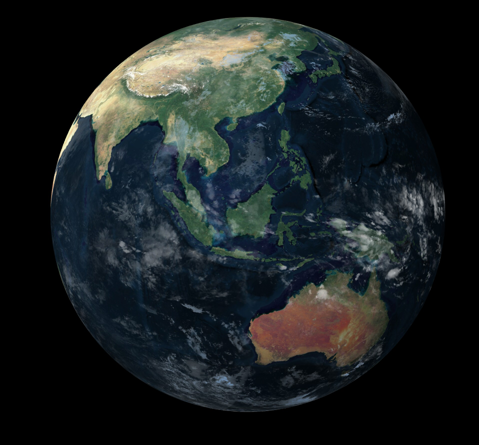

An experimental program to draw a 3d earth with head tracking and a cloud layer. It works more or less, but it does not produce a convincing 3d effect. Uses Python3 and panda3d.

* earth.py: Draw a 3d Earth, with a cloud layer.
* regenerate_cubemap.py: Re-download the cloud layer from satellite data (GOES-East, GOES-West, Himawari, Meteosat 8)
* faceserver.py: Locate the user's eyes in 3d space, using dlib and an Intel RealSense 2 camera.
* faceserver2.py: Locate the user's eyes in 3d space, using tflite and an Intel Realsense 2 camera.

Typical usage:
```
# Just draw the earth without head tracking. Instead, the mouse cursor is interpreted as the head position
python earth.py


# Draw the earth using dlib-based head tracking.
python faceserver.py &
python earth.py


# Draw the earth using tflite-based head tracking.
python faceserver2.py &
python earth.py
```

Example screenshot:


the landmarks file is copied from http://dlib.net/files/shape_predictor_68_face_landmarks.dat.bz2

the tflite model is copied from https://github.com/google/mediapipe/blob/master/mediapipe/models/face_detection_front.tflite
